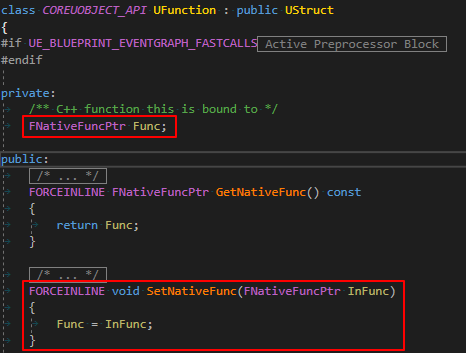
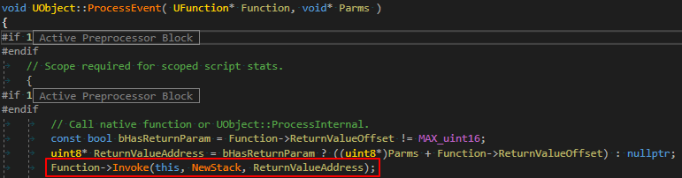
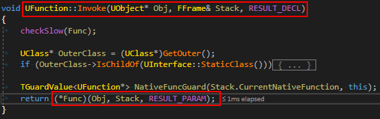
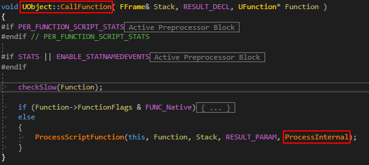
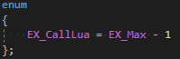
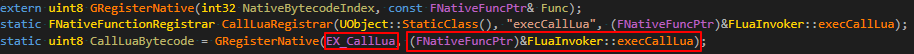
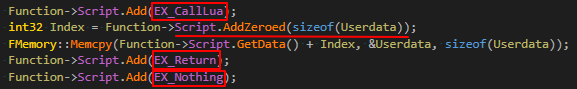
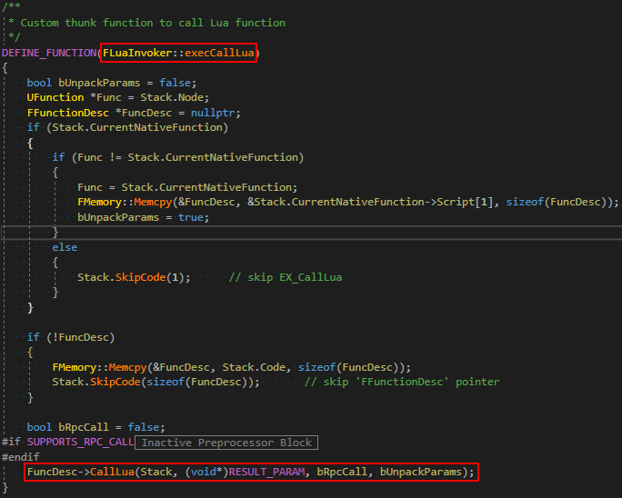

# 概述
零胶水代码替换各种蓝图和通知事件是 `UnLua` 的主要功能之一。本文主要介绍这套机制的原理，以及其对应的两种方案。

---

# Thunk 函数替换

## UFunction的Thunk函数

这里的 `Func` 就是所谓的 **thunk** 函数。

## UFunction的调用

假设我们有一个函数可以调用Lua，用它可以替换掉引擎里默认的thunk函数，就相当于覆盖了UFunction的实现。

---

# Opcode 注入

另外还有一种方式来调用非原生的UFunction：

这种情况下替换thunk函数是没有用的，但我们可以向UFunction注入一些 `特殊的Opcode` 来实现覆盖。

## 定义新Opcode

## 注册新Opcode

## 注入UFunction

