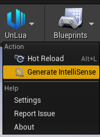
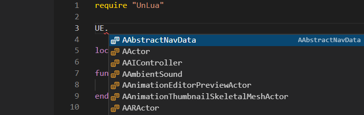

# 智能提示
## 1. 生成智能提示信息

打开UnLua工具栏，点击导出智能提示，会在`{UE工程}/Plugins/UnLua/Intermediate`下生成`IntelliSense`的目录。

## 2. 加入到LuaIDE

以VSCode为例，参考示例工程的[TPSProject.code-workspace](../../TPSProject.code-workspace)。一个工作区中分别添加了`Script`和`IntelliSense`，这样每次生成智能提示信息后会自动刷新，就不需要再手动拷贝了。

## 3. 完成

验证智能提示信息是否工作，只需要在工程的任意lua文件中输入`UE.`，正常应该就会显示引擎下所有类型的提示了。

如果没有出现提示，可以检查下IDE的智能提示插件是否存在或启用。