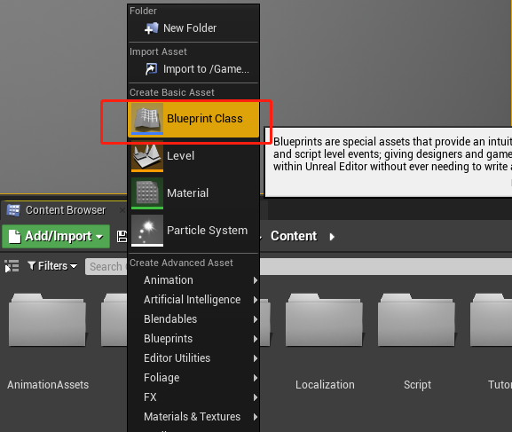
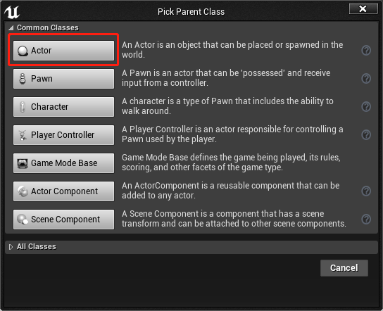
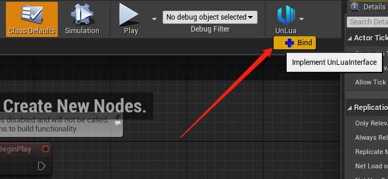
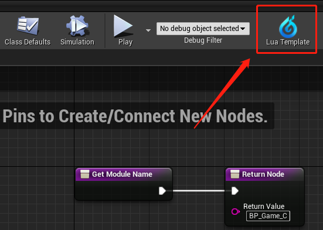
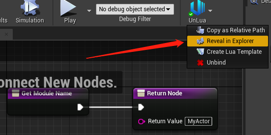

# 快速入门示例

本文站在UE新手视角，以Actor为父类作为用例，说明如何通过Lua来编写/覆盖蓝图逻辑。其他类型同样可以依此类推。

如果你是已经是UE的老手了，建议直接 [开始UnLua之旅](../../README.md#开始UnLua之旅)

## 1. 新建蓝图

## 2. 绑定到Lua
- 双击打开上一步新建好的蓝图，点击UnLua菜单栏中的“绑定”，默认会自动根据蓝图路径填充好Lua的模块路径（如图中①所示）。
- 如果下次需要修改绑定的路径，可以找到 `GetModuleName` 函数并双击进行修改（如图中②所示）。
- 完成后记得“编译”并“保存”（如图中③所示）。

## 3. 生成Lua模版代码
点击UnLua菜单栏中的“生成Lua模板文件”，会在工程 `Content/Script` 目录下生成。

##  4. 准备就绪

最后，用你喜欢的编辑器打开生成的文件，开始编写你的代码吧。

**注意**：在引擎的内容浏览器中是无法看到目录下的Lua脚本的，请使用系统的文件浏览器来查看，推荐将`Content/Script`加入到你的IDE工程中，这样就不需要每次都手动浏览了。