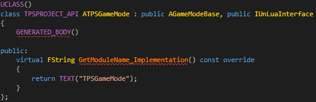
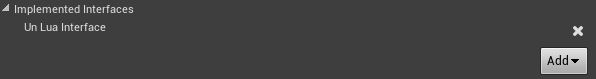
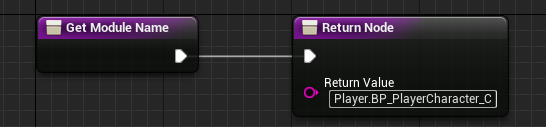
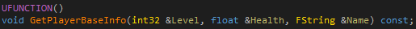
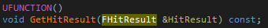
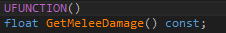
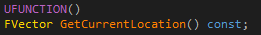
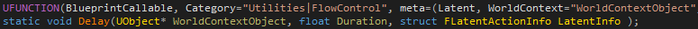
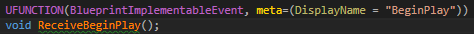
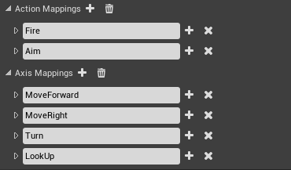

[TOC]

# 一、概述
UnLua是一个功能丰富、高度优化的UE脚本解决方案。开发者可以使用Lua来进行游戏逻辑编写，借助于Lua的热重载特性，可以获得快得多的游戏逻辑迭代速度。本文将会介绍UnLua的主要功能和基础编程模式。

---

# 二、Lua与引擎的绑定
UnLua提供了两种绑定Lua和引擎层的方式，分别是静态绑定和动态绑定：

## 静态绑定

#### C++
你的 UCLASS 只需要实现 `IUnLuaInterface` 接口，在 `GetModuleName_Implementation()` 里返回Lua文件路径即可。



#### 蓝图
你的蓝图只需要实现 `UnLuaInterface` 接口， 在 `GetModuleName()` 里返回Lua文件路径即可。




## 动态绑定
动态绑定适用于运行时Spawn出来的Actor和Object。

#### Actor
```cpp
local Proj = World:SpawnActor(ProjClass, Transform, ESpawnActorCollisionHandlingMethod.AlwaysSpawn, self, self.Instigator, "Weapon.BP_DefaultProjectile_C")
```
`Weapon.BP_DefaultProjectile_C` 是一个 [Lua模块路径](#Lua模块路径)。

#### Object
```lua
local ProxyObj = NewObject(ObjClass, nil, nil, "Objects.ProxyObject")
```
`Objects.ProxyObject` 是一个 [Lua模块路径](#Lua模块路径)。

## Lua模块路径
无论是静态绑定还是动态绑定，他们都需要指定Lua模块路径。它是一个相对于 **{工程目录}/Content/Script** 下Lua文件的 **相对路径**，使用半角点号 **.** 分隔。

---

# 三、从Lua调用引擎
UnLua提供了两种方式从Lua侧访问引擎：
1. 使用反射系统动态导出
2. 绕过反射系统，静态导出诸如类、成员变量、成员函数、全局函数、枚举等

## 使用反射系统动态导出
动态导出使用反射系统，代码更干净简洁，不需要大量的胶水代码。

### 访问 UCLASS
```lua
local Widget = UE.UWidgetBlueprintLibrary.Create(self, UE.UClass.Load("/Game/Core/UI/UMG_Main_C"))
```

**UE** 是一个全局对象，当访问它上面的属性时，会通过懒加载的方式获取引擎类型。

**UWidgetBlueprintLibrary** 是一个 UCLASS。其Lua类名规则必须是：

`C++前缀` + `类名` + ``_C``

其中后缀 `_C` 表示为蓝图类型，例如: `AActor` (原生类)， `ABP_PlayerCharacter_C`（蓝图类）

### 访问 UFUNCTION
```lua
Widget:AddToViewport(0)
```
`AddToViewport` 是 `UUserWidget` 的一个 UFUNCTION， `0` 是函数参数。
如果 UFUNCTION （标记了`BlueprintCallable` 或 `Exec`）的某个参数有默认值，在Lua代码里可以忽略不传：
```lua
Widget:AddToViewport()
```

#### 处理输出值
输出值包含了 **非常量参数** 和 **返回参数**，他们都会区分 **基本类型（bool, integer, number, string）** 和 **非基本类型（userdata）**。

##### 非常量参数
###### 基本类型


Lua代码：
```lua
local Level, Health, Name = self:GetPlayerBaseInfo()
```

###### 非基本类型


有两种方式在Lua里调用：

```lua
local HitResult = FHitResult()
self:GetHitResult(HitResult)
```
或者：
```lua
local HitResult = self:GetHitResult()
```
第一种用法和C++更像，比第二种性能高效得多，特别是循环里多次调用的时候。

##### 返回参数
###### 基本类型


Lua代码：
```lua
local MeleeDamage = self:GetMeleeDamage()
```

###### 非基本类型


有三种方式在Lua里调用：
```lua
local Location = self:GetCurrentLocation()
```
或者：
```lua
local Location = UE.FVector()
self:GetCurrentLocation(Location)
```
还有：
```lua
local Location = UE.FVector()
local LocationCopy = self:GetCurrentLocation(Location)
```
第一种最直观，但后面两种在循环中多次调用的时候性能更高。第三种相当于：
```lua
local Location = UE.FVector()
self:GetCurrentLocation(Location)
local LocationCopy = Location
```

#### Latent 函数
Latent 函数 允许开发者用同步代码的风格来写异步逻辑。**Delay** 是一个经典的 Latent 函数：



我们可以在Lua协程里调用Latent 函数：

```lua
coroutine.resume(coroutine.create(function(GameMode, Duration)
    UE.UKismetSystemLibrary.Delay(GameMode, Duration)
end), self, 5.0)
```

### 访问 USTRUCT
```lua
local Position = UE.FVector()
```
**FVector** 是一个 USTRUCT。

### 访问 UPROPERTY
```lua
local Position = FVector()
Position.X = 256.0
```
**X** 是 **FVector** 的一个 UPROPERTY.

### 委托

以下示例中，第一个参数是一个`UObject`，指明了这个委托绑定的生命周期。换言之当对象失效后，比如被垃圾回收了，对应的回调也会随之无效。

因此对业务代码而言，在对象被销毁时对所有的委托手动解绑不是必须的（虽然绑定和解绑对应是个良好的编码习惯）。

#### 单播委托 Delegate
`self.Track` 是一个 `FTimelineFloatTrack`
```lua
-- 绑定
self.Track.InterpFunc:Bind(self, self.OnZoomInOutUpdate)

-- 解绑
self.Track.InterpFunc:Unbind(self, self.OnZoomInOutUpdate)

-- 执行
self.Track.InterpFunc:Execute(0.5)
```

#### 多播委托 MulticastDelegate
`self.Button` 是一个 `UButton`
```lua
-- 增加回调
self.Button.OnClicked:Add(self, self.OnClicked_ExitButton)

-- 移除回调
self.Button.OnClicked:Remove(self, self.OnClicked_ExitButton)

-- 清理所有回调
self.Button.OnClicked:Clear()

-- 广播触发所有回调
self.Button.OnClicked:Broadcast()
```

#### 赋值和参数传递
```lua

-- 赋值（相当于绑定）
self.Track.InterpFunc = { self, self.OnZoomInOutUpdate }

-- 传递委托参数
UE.UKismetSystemLibrary.K2_SetTimerDelegate({ self, self.OnZoomInOutUpdate }, 1, true)
```

### 枚举 UENUM
```lua
-- C++类型
print(UE.EAttachmentRule.SnapToTarget)

-- 蓝图类型（UUserDefinedEnum）
local MyEnum = UE.UObject.Load("/Game/Enums/MyEnum")
print(MyEnum.Value1)

-- 自定义碰撞枚举类型
print(UE.EObjectTypeQuery.Player)
print(UE.ETraceTypeQuery.Weapon)
```

[自定义碰撞枚举](./CollisionEnum.md)可以直接按配置的名称访问枚举值。

---

# 四、从引擎调用Lua
UnLua 提供了一个类似蓝图的解决方案来跨C++/脚本边界，可以通过C++/蓝图代码来调用Lua。

## 替换蓝图事件
我们可以用Lua代码覆盖替换所有 **蓝图事件** 的实现，包括：

* 标记为 **'BlueprintImplementableEvent'** 的 UFUNCTION
* 标记为 **'BlueprintNativeEvent'** 的 UFUNCTION
* **所有** 蓝图中定义的 事件/函数

### 示例 (无返回值的蓝图事件)



我们可以在Lua里直接替换：
```lua
function BP_PlayerController_C:ReceiveBeginPlay()
    print("ReceiveBeginPlay in Lua!")
end
```

### 示例 (带返回值的蓝图事件)


我们可以在Lua中依次返回返回值和Out参数，如果不返回Out参数，则默认返回传入参数

```lua
function BP_PlayerCharacter_C:GetCharacterInfo(HP, Position, Name)
    return true, 99, FVector(128.0, 128.0, 0.0), "Marcus"
end
```

## 替换动画事件


```lua
function ABP_PlayerCharacter_C:AnimNotify_NotifyPhysics()
    UBPI_Interfaces_C.ChangeToRagdoll(self.Pawn)
end
```
Lua函数的名字必须为：**'AnimNotify_'** + **{事件名}**

## 替换输入事件


参考示例：[03_BindInputs](../../Content/Script/Tutorials/03_BindInputs.lua)

## 替换Replication事件
参考示例：[10_Replications](../../Content/Script/Tutorials/10_Replications.lua)

## 调用被替换的函数
如果你用Lua覆盖了原来的实现，仍然可以通过 `Overridden` 访问原来的函数。
```lua
function BP_PlayerController_C:ReceiveBeginPlay()
    local Widget = UWidgetBlueprintLibrary.Create(self, UClass.Load("/Game/Core/UI/UMG_Main"))
    Widget:AddToViewport()
    self.Overridden.ReceiveBeginPlay(self)
end
```
`self.Overridden.ReceiveBeginPlay(self)` 将会调用原来蓝图中实现的 `ReceiveBeginPlay`。

## 从C++调用Lua函数

* 全局函数
```
template <typename... T>
FLuaRetValues Call(lua_State *L, const char *FuncName, T&&... Args);
```

* 全局表里的函数
```
template <typename... T>
FLuaRetValues CallTableFunc(lua_State *L, const char *TableName, const char *FuncName, T&&... Args);
```

---

# 五、垃圾回收

从UnLua 2.2 版本开始，Lua环境不会再对`UObject`加引用，因此也不用再担心对象在Lua侧被引用着，导致一直无法释放的内存泄漏问题了。

如果在Lua侧访问了某个被UEGC回收的对象，会提示类似 `attempt to read property on released object` 的错误。

当遇到这样的报错，应该保证对象在UE引用链上，可以采取以下几种方案：

1. 将对象赋值到某个UPROPERTY上，可以是C++的也可以是蓝图的属性
2. 将对象AddToRoot
3. 使用 `UnLua.Ref(Object)` 创建一个[引用代理](#引用代理)

## 引用代理

当需要在Lua侧保持对某个`UObject`引用，又没有合适的引用链来赋值时，可以使用 `UnLua.Ref` 接口来创建一个引用代理：

```lua
local MyClass = UE.UClass.Load("/Game/MyClass")

-- 只要RefProxy这个对象没有被luagc，就能一直对MyClass这个对象持有引用
RefProxy = UnLua.Ref(MyClass)

-- 赋值为nil之后，引用代理就会在下次luagc中被回收，从而解除对UObject的引用
RefProxy = nil
```

对同一个 `UObject` 多次调用 `UnLua.Ref`，每次返回的都是同一个引用代理，因此不需要担心重复引用的问题。

另外，也可以借助引用代理在lua侧的生命周期，来同步对`UObject`的引用生命周期：

```lua
-- 比如有个UMyWidget类型（其他声明省略）
function UMyWidget:Construct()
    self.MyClass = UE.UClass.Load("/Game/MyClass")
    self.ClassRef = UnLua.Ref(self.MyClass)
end

-- 创建一个它的实例，并AddToViewport
-- 由于MyWidget在UE引用链上，因此这个UI不会被UE回收
-- 对应在lua侧绑定的table也不会被回收，从而MyClass也不会被回收
local MyWidget = NewObject(UMyWidget)
MyWidget:AddToViewport()

-- 一旦移除UE引用链，MyWidget会被UEGC
-- 从而引起lua侧的table可被LuaGC，且ClassRef也可被GC
-- 因此可以理解为引用代理将Lua对UObject的引用同步到了UE侧
MyWidget:RemoveFromViewport()

```

有时候逻辑上可能忘了将代理对象置空解除引用，或者期望能够立即解除引用（比如“进入游戏时释放所有大厅UI”这样明确的时机）。

可以使用 `UnLua.Unref(Object)` 来强制解除引用。

解除引用之后，UEGC就可以正常回收这个对象了。一旦回收，所有Lua侧再次访问这个对象就会提示错误，可以方便地补上释放逻辑。

# 六、其他

[静态导出](./StaticExportBinding.md)
[自定义生成Lua模版](./CustomTemplate.md)