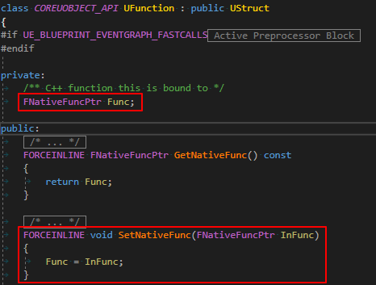
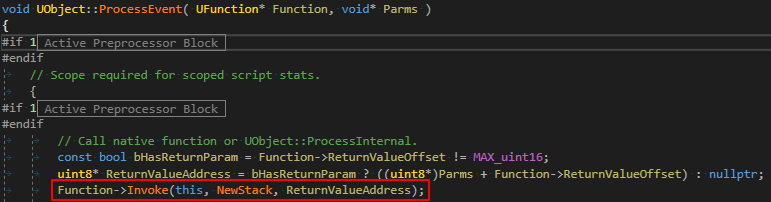
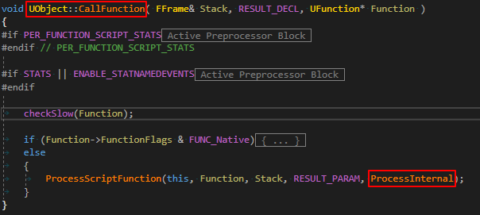
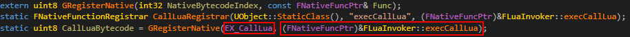

# Overview
The main feature of UnLua is overriding 'BlueprintEvent', 'AnimNotify', 'RepNotify', 'InputEvent' without helper codes. This document will introduce the two methods to implement overriding.

---

# Thunk Function Replacement

## Thunk function of UFunction

'Func' is the **thunk** function.

## UFunction invoking

If replacing the engine's default thunk function with a customized thunk function that calling Lua function, we can override the UFunction.

---

# Opcode Injection

There is another path to call non-native UFunction:

Replacing thunk function is useless in this case, and we can inject special Opcodes to UFunction to implement overriding.

## New opcode definition

## New opcode registering

## Injection

