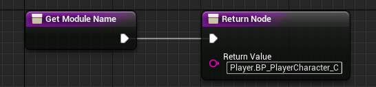
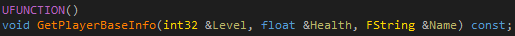
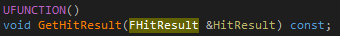
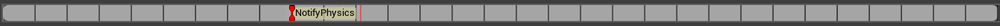

[TOC]

# Overview
UnLua is a feature-rich and high optimized scripting solution for UE. Developes can develop game logic using Lua with it, and it's possible to iterate game logic much more faster with Lua's hotload feature. This document will introduce the major features and basic programming pattern of UnLua.

---

# Lua&Engine Binding
UnLua provides a simple way to bind Lua and engine, including static binding and dynamic binding:

## Static Binding

#### C++
Your UCLASS only need to implement **IUnLuaInterface**, and return a Lua file path in **GetModuleName_Implementation()**.


#### Blueprints
Your blueprint only need to implement **UnLuaInterface**, and return a Lua file path in **GetModuleName()**.



## Dynamic Binding
Dynamic binding is suitable for runtime spawned Actors and Objects.

#### Actor
```
local Proj = World:SpawnActor(ProjClass, Transform, ESpawnActorCollisionHandlingMethod.AlwaysSpawn, self, self.Instigator, "Weapon.BP_DefaultProjectile_C")
```
**“Weapon.BP_DefaultProjectile_C”** is a Lua file path.

#### Object
```
local ProxyObj = NewObject(ObjClass, nil, nil, "Objects.ProxyObject")
```
**“Objects.ProxyObject”** is a Lua file path.

## Lua File Path
Both static and dynamic binding need a Lua file path. It's a **relative** path to project's **'Content/Script'**.

---

# Lua Calls Engine
UnLua provides two ways to access engine from Lua side: 1. dynamically export using reflection system; 2. statically export classes, member variables, member functions, global functions and enums outside the reflection system.

## Dynamically Export using Reflection System
Dynamically export using reflection system makes codes clean, intuitive, and it can eliminate huge glue codes.

### Access UCLASS
```
local Widget = UWidgetBlueprintLibrary.Create(self, UClass.Load("/Game/Core/UI/UMG_Main"))
```
**UWidgetBlueprintLibrary** is a UCLASS. Class' name in Lua must be **PrefixCPP** + **ClassName** + **[``_C``]**, for example: **AActor** (Native Class), **ABP_PlayerCharacter_C**（Blueprint Class）

### Access UFUNCTION
```
Widget:AddToViewport(0)
```
**AddToViewport** is a UFUNCTION of **UUserWidget**. **0** is the function parameter. If a parameter of UFUNCTION (tagged with **'BlueprintCallable'** or **'Exec'**) has a default value, it can be ignored in Lua codes:
```
Widget:AddToViewport()
```

#### Output Values Handling
Output Values includes **non-const reference parameters** and **return parameter**. Both of them distinguish **primitive types (bool, integer, number, string)** and **non-primitive types (userdata)**.

##### Non-Const Reference Parameters
###### Primitive Types


Lua codes：
```
local Level, Health, Name = self:GetPlayerBaseInfo()
```

###### Non-Primitive Types


There are two ways to call it in Lua:
```
local HitResult = FHitResult()
self:GetHitResult(HitResult)
```
Or
```
local HitResult = self:GetHitResult()
```
The first one is similiar to C++, it's much more efficient than the second one when called multiple times such as in a loop.

##### Return Parameter
###### Primitive Types


Lua codes：
```
local MeleeDamage = self:GetMeleeDamage()
```

###### Non-Primitive Types


There are three ways to call it in Lua:
```
local Location = self:GetCurrentLocation()
```
Or
```
local Location = FVector()
self:GetCurrentLocation(Location)
```
Or
```
local Location = FVector()
local LocationCopy = self:GetCurrentLocation(Location)
```
The first one is most intuitive, however the latter two are much more efficient than the first one when called multiple times such as in a loop. The last one is equivalent to:
```
local Location = FVector()
self:GetCurrentLocation(Location)
local LocationCopy = Location
```

#### Latent Function
Latent functions allow developers to develop asynchronous logic using synchronous coding style. A typical latent function is **Delay**:


You can call latent function in Lua coroutines:
```
coroutine.resume(coroutine.create(function(GameMode, Duration) UKismetSystemLibrary.Delay(GameMode, Duration) end), self, 5.0)
```

#### Optimization
UnLua optimizes UFUNCTION invoking in following two points:

 * Persistent parameters buffer
 * Optimized local function invoking
 * Optimized parameters passing
 * Optimized output values handling

### Access USTRUCT
```
local Position = FVector()
```
**FVector** is a USTRUCT.

### Access UPROPERTY
```
local Position = FVector()
Position.X = 256.0
```
**X** is a UPROPERTY of **FVector**.

#### Delegates
* Bind
```
FloatTrack.InterpFunc:Bind(self, BP_PlayerCharacter_C.OnZoomInOutUpdate)
```
**InterpFunc** is a Delegate of FTimelineFloatTrack, **'Bind'** binds a callback (**BP_PlayerCharacter_C.OnZoomInOutUpdate**) for **InterpFunc**.

* Unbind
```
FloatTrack.InterpFunc:Unbind()
```
**InterpFunc** is a Delegate of FTimelineFloatTrack, **'Unbind'** unbinds the callback for **InterpFunc**.

* Execute
```
FloatTrack.InterpFunc:Execute(0.5)
```
**InterpFunc** is a Delegate of FTimelineFloatTrack, **'Execute'** calls the function on the object bound to **InterpFunc**.


#### Multicast Delegates
* Add
```
 self.ExitButton.OnClicked:Add(self, UMG_Main_C.OnClicked_ExitButton)
```
**OnClicked** is a MulticastDelegate of UButton, **'Add'** adds a callback (**UMG_Main_C.OnClicked_ExitButton**) for **OnClicked**.

* Remove
```
 self.ExitButton.OnClicked:Remove(self, UMG_Main_C.OnClicked_ExitButton)
```
**OnClicked** is a MulticastDelegate of UButton, **'Remove'** removes a callback (**UMG_Main_C.OnClicked_ExitButton**) for **OnClicked**.

* Clear
```
 self.ExitButton.OnClicked:Clear()
```
**OnClicked** is a MulticastDelegate of UButton, **'Clear'** clears all callbacks for **OnClicked**.

* Broadcast
```
 self.ExitButton.OnClicked:Broadcast()
```
**OnClicked** is a MulticastDelegate of UButton, **'Broadcast'** calls all functions on objects bound to **OnClicked**.

### Access UENUM
```
Weapon:K2_AttachToComponent(Point, nil, EAttachmentRule.SnapToTarget, EAttachmentRule.SnapToTarget, EAttachmentRule.SnapToTarget)
```
**EAttachmentRule** is a UENUM, **SnapToTarget** is an entry of **EAttachmentRule**.

#### Customized Collision Enums


* EObjectTypeQuery
```
local ObjectTypes = TArray(EObjectTypeQuery)
ObjectTypes:Add(EObjectTypeQuery.Player)
ObjectTypes:Add(EObjectTypeQuery.Enemy)
ObjectTypes:Add(EObjectTypeQuery.Projectile)
local bHit = UKismetSystemLibrary.LineTraceSingleForObjects(self, Start, End, ObjectTypes, false, nil, EDrawDebugTrace.None, HitResult, true)
```
**EObjectTypeQuery.Player**, **EObjectTypeQuery.Enemy** and **EObjectTypeQuery.Projectile** are customized Object Channels.

* ETraceTypeQuery
```
local bHit = UKismetSystemLibrary.LineTraceSingle(self, Start, End, ETraceTypeQuery.Weapon, false, nil, EDrawDebugTrace.None, HitResult, true)
```
**ETraceTypeQuery.Weapon** is a customized Trace Channel.

### Manually Exported Libraries
For customization and performance considerations, UnLua manually exports several important classes in the engine, including the following (See the codes for details):

#### Basic Classes
 * UObject
 * UClass
 * UWorld
 
#### Common Containers
 * TArray
 * TSet
 * TMap
 
##### Example
```
	local Indices = TArray(0)
	Indices:Add(1)
	Indices:Add(3)
	Indices:Remove(0)
	local NbIndices = Indices:Length()
```
```
	local Vertices = TArray(FVector)
	local Actors = TArray(AActor)
```

#### Math Libraries
 * FVector
 * FVector2D
 * FVector4
 * FQuat
 * FRotator
 * FTransform
 * FColor
 * FLinearColor
 * FIntPoint
 * FIntVector

## Statically Export
UnLua provides a simple solution to export classes, member variables, member functions, global functions and enums outside the reflection system statically.

### Classes
* Non-reflected classes
```
BEGIN_EXPORT_CLASS(ClassType, ...)
```
 Or
```
BEGIN_EXPORT_NAMED_CLASS(ClassName, ClassType, ...)
```
 **'...'** means type list of parameters in constructor.

* Reflected classes
```
BEGIN_EXPORT_REFLECTED_CLASS(UObjectType)
```
 Or
```
BEGIN_EXPORT_REFLECTED_CLASS(NonUObjectType, ...)
```
 **'...'** means type list of parameters in constructor.

#### Member Variables
```
ADD_PROPERTY(Property)
```
Or (for bitfield bool property)
```
ADD_BITFIELD_BOOL_PROPERTY(Property)
```

#### Member Functions
##### Non-static member functions
* Compact style
```
ADD_FUNCTION(Function)
```
 Or
```
ADD_NAMED_FUNCTION(Name, Function)
```

* Complete style
```
ADD_FUNCTION_EX(Name, RetType, Function, ...)
```
 Or
```
ADD_CONST_FUNCTION_EX(Name, RetType, Function, ...)
```
 **'...'** means parameter types.

##### Static member functions
```
ADD_STATIC_FUNCTION(Function)
```
Or
```
ADD_STATIC_FUNCTION_EX(Name, RetType, Function, ...)
```
**'...'** means parameter types.

#### Example
```
struct Vec3
{
	Vec3() : x(0), y(0), z(0) {}
	Vec3(float _x, float _y, float _z) : x(_x), y(_y), z(_z) {}

	void Set(const Vec3 &V) { *this = V; }
	Vec3& Get() { return *this; }
	void Get(Vec3 &V) const { V = *this; }

	bool operator==(const Vec3 &V) const { return x == V.x && y == V.y && z == V.z; }

	static Vec3 Cross(const Vec3 &A, const Vec3 &B) { return Vec3(A.y * B.z - A.z * B.y, A.z * B.x - A.x * B.z, A.x * B.y - A.y * B.x); }
	static Vec3 Multiply(const Vec3 &A, float B) { return Vec3(A.x * B, A.y * B, A.z * B); }
	static Vec3 Multiply(const Vec3 &A, const Vec3 &B) { return Vec3(A.x * B.x, A.y * B.y, A.z * B.z); }

	float x, y, z;
};

BEGIN_EXPORT_CLASS(Vec3, float, float, float)
	ADD_PROPERTY(x)
	ADD_PROPERTY(y)
	ADD_PROPERTY(z)
	ADD_FUNCTION(Set)
	ADD_NAMED_FUNCTION("Equals", operator==)
	ADD_FUNCTION_EX("Get", Vec3&, Get)
	ADD_CONST_FUNCTION_EX("GetCopy", void, Get, Vec3&)
	ADD_STATIC_FUNCTION(Cross)
	ADD_STATIC_FUNCTION_EX("MulScalar", Vec3, Multiply, const Vec3&, float)
	ADD_STATIC_FUNCTION_EX("MulVec", Vec3, Multiply, const Vec3&, const Vec3&)
END_EXPORT_CLASS()
IMPLEMENT_EXPORTED_CLASS(Vec3)
```

### Global Functions
```
EXPORT_FUNCTION(RetType, Function, ...)
```
Or
```
EXPORT_FUNCTION_EX(Name, RetType, Function, ...)
```
**'...'** means parameter types.

#### Example
```
void GetEngineVersion(int32 &MajorVer, int32 &MinorVer, int32 &PatchVer)
{
	MajorVer = ENGINE_MAJOR_VERSION;
	MinorVer = ENGINE_MINOR_VERSION;
	PatchVer = ENGINE_PATCH_VERSION;
}

EXPORT_FUNCTION(void, GetEngineVersion, int32&, int32&, int32&)
```

### Enums
* Unscoped enumeration
```
enum EHand
{
	LeftHand,
	RightHand
};

BEGIN_EXPORT_ENUM(EHand)
	ADD_ENUM_VALUE(LeftHand)
	ADD_ENUM_VALUE(RightHand)
END_EXPORT_ENUM(EHand)
```

* Scoped enumeration
```
enum class EEye
{
	LeftEye,
	RightEye
};

BEGIN_EXPORT_ENUM(EEye)
	ADD_SCOPED_ENUM_VALUE(LeftEye)
	ADD_SCOPED_ENUM_VALUE(RightEye)
END_EXPORT_ENUM(EEye)
```

## Optional 'UE' Namespace
UnLua provides an option to add a namespace **'UE'** to all classes and enums in the engine. You can find this option in **UnLua.Build.cs**.


If this option is enabled, your Lua codes should be:
```
local Position = UE.FVector()
```

---

# Engine Calls Lua
UnLua provides a Blueprint-like solution to cross the C++/Script boundary. It allows C++/Blueprint codes to call functions that are defined in Lua codes. 

## Override BlueprintEvent
Your can override all **BlueprintEvent** in Lua codes. **BlueprintEvent** includes:

* UFUNCTION tagged with **'BlueprintImplementableEvent'**
* UFUNCTION tagged with **'BlueprintNativeEvent'**
* **All** Events/Functions Defined in Blueprints

### Example (BlueprintEvent without Return Value)


You can override it in Lua:
```
function BP_PlayerController_C:ReceiveBeginPlay()
  print("ReceiveBeginPlay in Lua!")
end
```

### Example (BlueprintEvent with Return Values)


There are two ways to override it in Lua:
```
function BP_PlayerCharacter_C:GetCharacterInfo(HP, Position, Name)
	Position.X = 128.0
	Position.Y = 128.0
	Position.Z = 0.0
	return 99, nil, "Marcus", true
end
```
Or
```
function BP_PlayerCharacter_C:GetCharacterInfo(HP, Position, Name)
	return 99, FVector(128.0, 128.0, 0.0), "Marcus", true
end
```
The first one is preferred.

## Override Animation Notifies
AnimNotify:



Lua codes:
```
function ABP_PlayerCharacter_C:AnimNotify_NotifyPhysics()
	UBPI_Interfaces_C.ChangeToRagdoll(self.Pawn)
end
```
Lua function's name must be **'AnimNotify_'** + **NotifyName**.

## Override Input Events


#### Action Inputs
```
function BP_PlayerController_C:Aim_Pressed()
	UBPI_Interfaces_C.UpdateAiming(self.Pawn, true)
end

function BP_PlayerController_C:Aim_Released()
	UBPI_Interfaces_C.UpdateAiming(self.Pawn, false)
end
```
Lua function's name must be **ActionName** + **'_Pressed' / '_Released'**.

#### Axis Inputs
```
function BP_PlayerController_C:Turn(AxisValue)
	self:AddYawInput(AxisValue)
end

function BP_PlayerController_C:LookUp(AxisValue)
	self:AddPitchInput(AxisValue)
end
```
Lua function's name must be the same with **AxisName**.

#### Key Inputs
```
function BP_PlayerController_C:P_Pressed()
	print("P_Pressed")
end

function BP_PlayerController_C:P_Released()
	print("P_Released")
end
```
Lua function's name must be **KeyName** + **'_Pressed' / '_Released'**.

#### Other Inputs
You can also override **Touch/AxisKey/VectorAxis/Gesture Inputs** in Lua.

## Override Replication Notifies
If you are developing dedicated/listenning server&amp;clients game, you can override replication notifies in Lua codes:


```
function BP_PlayerCharacter_C:OnRep_Health(...)
	print("call OnRep_Health in Lua")
end
```

## Call Overridden Functions
If you override a 'BlueprintEvent', 'AnimNotify' or 'RepNotify' in Lua, you can still access original function implementation.
```
function BP_PlayerController_C:ReceiveBeginPlay()
	local Widget = UWidgetBlueprintLibrary.Create(self, UClass.Load("/Game/Core/UI/UMG_Main"))
	Widget:AddToViewport()
	self.Overridden.ReceiveBeginPlay(self)
end
```

**self.*Overridden*.ReceiveBeginPlay(self)** will call Blueprint implemented 'ReceiveBeginPlay'.

## Call Lua Functions in C++
UnLua also provides two generic methods to call global Lua funtions and functions in global Lua table in C++ codes.

* Global functions
```
template <typename... T>
FLuaRetValues Call(lua_State *L, const char *FuncName, T&&... Args);
```

* Functions in global table
```
template <typename... T>
FLuaRetValues CallTableFunc(lua_State *L, const char *TableName, const char *FuncName, T&&... Args);
```

---

# Others

* Lua Template File Export

You can export Lua template file for blueprints:


The template file:


