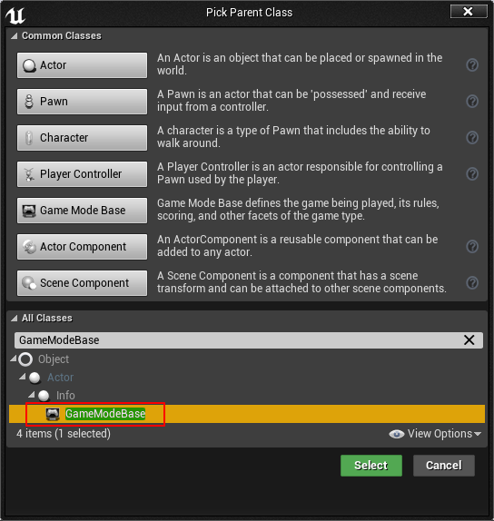
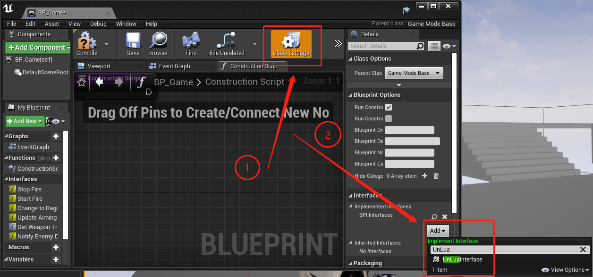
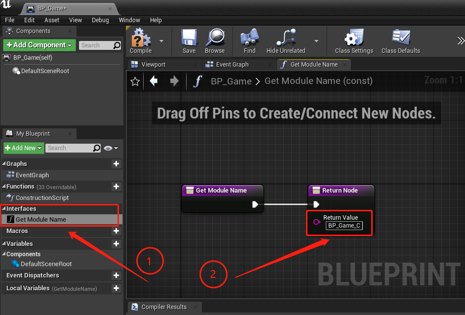
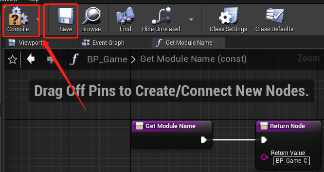
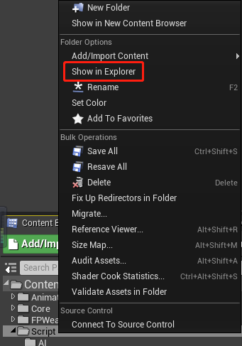

#  快速入门示例

本文站在UE新手视角，以GameModeBase为父类作为用例，说明如何通过Lua来编写/覆盖蓝图逻辑。其他类型同样可以依此类推。

如果你是已经是UE的老手了，建议直接[开始UnLua之旅](../README.md#开始UnLua之旅)

##  1. 新建蓝图

  
##  2. 添加接口 `UnLuaInterface`
双击打开上一步新建好的蓝图，如下图依次操作

 
##  3. 设置Lua文件路径
双击打开左侧Interfaces下的 `GetModule` 函数，在右侧 `Return Value` 节点中填入Lua文件路径，如 `BP_MyGame_C`

##  4. 生成Lua模版代码
点击菜单栏中的 `Lua Template` 图标生成Lua模版文件

##  5. 编译并保存
依次点击菜单栏中的 `编译（Compile）`、`保存（Save）`，确保我们的修改生效

##  6. 准备就绪
最后，用你喜欢的编辑器打开 `Content/Script/GameModes/BP_MyGameMode_C.lua` 开始编写你的代码吧。

**注意**：在内容浏览器（Content Browser）中是无法看到目录下的Lua脚本的，请使用系统的文件浏览器来查看。

