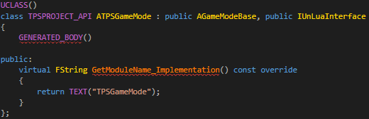
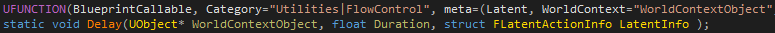
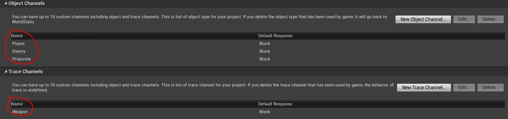
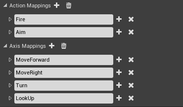
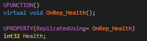
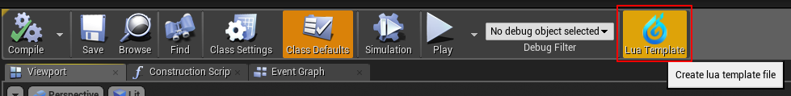
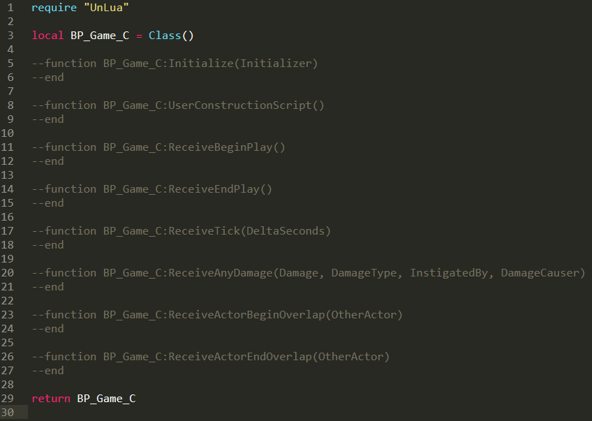

[TOC]

# 概述
UnLua是一个功能丰富、高度优化的UE脚本解决方案。开发者可以使用Lua来进行游戏逻辑编写，借助于Lua的热重载特性，可以获得快得多的游戏逻辑迭代速度。本文将会介绍UnLua的主要功能和基础编程模式。

---

# Lua与引擎的绑定
UnLua提供了两种绑定Lua和引擎层的方式，分别是静态绑定和动态绑定：

## 静态绑定

#### C++
你的 UCLASS 只需要实现 `IUnLuaInterface` 接口，在 `GetModuleName_Implementation()` 里返回Lua文件路径即可。



#### 蓝图
你的蓝图只需要实现 `UnLuaInterface` 接口， 在 `GetModuleName()` 里返回Lua文件路径即可。


## 动态绑定
动态绑定适用于运行时Spawn出来的Actor和Object。

#### Actor
```
local Proj = World:SpawnActor(ProjClass, Transform, ESpawnActorCollisionHandlingMethod.AlwaysSpawn, self, self.Instigator, "Weapon.BP_DefaultProjectile_C")
```
`Weapon.BP_DefaultProjectile_C` 是一个 [Lua文件路径](#Lua文件路径)。

#### Object
```
local ProxyObj = NewObject(ObjClass, nil, nil, "Objects.ProxyObject")
```
`Objects.ProxyObject` 是一个 [Lua文件路径](#Lua文件路径)。

## Lua文件路径
无论是静态绑定还是动态绑定，他们都需要指定Lua文件路径。它是一个相对于 **{工程目录}/Content/Script** 下的 **相对路径**。

---

# 从Lua调用引擎
UnLua提供了两种方式从Lua侧访问引擎：
1. 使用反射系统动态导出
2. 绕过反射系统，静态导出诸如类、成员变量、成员函数、全局函数、枚举等

## 使用反射系统动态导出
动态导出使用反射系统，代码更干净简洁，不需要大量的胶水代码。

### 访问 UCLASS
```
local Widget = UWidgetBlueprintLibrary.Create(self, UClass.Load("/Game/Core/UI/UMG_Main"))
```
**UWidgetBlueprintLibrary** 是一个 UCLASS。其Lua类名规则必须是：

`C++前缀` + `类名` + ``_C``

其中后缀 `_C` 为可选规则，例如: `AActor` (原生类)， `ABP_PlayerCharacter_C`（蓝图类）

### 访问 UFUNCTION
```
Widget:AddToViewport(0)
```
`AddToViewport` 是 `UUserWidget` 的一个 UFUNCTION， `0` 是函数参数。
如果 UFUNCTION （标记了`BlueprintCallable` 或 `Exec`）的某个参数有默认值，在Lua代码里可以忽略不传：
```
Widget:AddToViewport()
```

#### 处理输出值
输出值包含了 **非常量参数** 和 **返回参数**，他们都会区分 **基本类型（bool, integer, number, string）** 和 **非基本类型（userdata）**。

##### 非常量参数
###### 基本类型


Lua代码：
```
local Level, Health, Name = self:GetPlayerBaseInfo()
```

###### 非基本类型


有两种方式在Lua里调用：

```
local HitResult = FHitResult()
self:GetHitResult(HitResult)
```
或者：
```
local HitResult = self:GetHitResult()
```
第一种用法和C++更像，比第二种性能高效得多，特别是循环里多次调用的时候。

##### 返回参数
###### 基本类型


Lua代码：
```
local MeleeDamage = self:GetMeleeDamage()
```

###### 非基本类型


有三种方式在Lua里调用：
```
local Location = self:GetCurrentLocation()
```
或者：
```
local Location = FVector()
self:GetCurrentLocation(Location)
```
还有：
```
local Location = FVector()
local LocationCopy = self:GetCurrentLocation(Location)
```
第一种最直观，但后面两种在循环中多次调用的时候性能更高。第三种相当于：
```
local Location = FVector()
self:GetCurrentLocation(Location)
local LocationCopy = Location
```

#### Latent 函数
Latent 函数 允许开发者用同步代码的风格来写异步逻辑。**Delay** 是一个经典的 Latent 函数：



我们可以在Lua协程里调用Latent 函数：

```
coroutine.resume(coroutine.create(function(GameMode, Duration) UKismetSystemLibrary.Delay(GameMode, Duration) end), self, 5.0)
```

#### 优化
UnLua通过以下几点优化 UFUNCTION 调用：
 * 持久化参数缓存
 * 优化本地函数调用
 * 优化传参
 * 优化输出值处理

### 访问 USTRUCT
```
local Position = FVector()
```
**FVector** 是一个 USTRUCT。

### 访问 UPROPERTY
```
local Position = FVector()
Position.X = 256.0
```
**X** 是 **FVector** 的一个 UPROPERTY.

#### 委托
* Bind
```
FloatTrack.InterpFunc:Bind(self, BP_PlayerCharacter_C.OnZoomInOutUpdate)
```
**InterpFunc** 是 `FTimelineFloatTrack` 的一个委托， 通过 **'Bind'** 绑定了一个回调 (**BP_PlayerCharacter_C.OnZoomInOutUpdate**) 到 **InterpFunc**。

* Unbind
```
FloatTrack.InterpFunc:Unbind()
```
**InterpFunc** 是 `FTimelineFloatTrack` 的一个委托， 通过 **'Unbind'** 解绑了 **InterpFunc** 的回调。

* Execute
```
FloatTrack.InterpFunc:Execute(0.5)
```
**InterpFunc** 是 `FTimelineFloatTrack` 的一个委托，通过 **'Execute'** 执行绑定在 **InterpFunc** 上的回调。


#### 多播委托
* Add
```
 self.ExitButton.OnClicked:Add(self, UMG_Main_C.OnClicked_ExitButton)
```
**OnClicked** 是 `UButton` 的一个多播委托，通过 **`Add`** 增加了一个回调 (**UMG_Main_C.OnClicked_ExitButton**) 到 **OnClicked**。

* Remove
```
 self.ExitButton.OnClicked:Remove(self, UMG_Main_C.OnClicked_ExitButton)
```
**OnClicked** 是 `UButton` 的一个多播委托，通过 **`Remove`** 移除了一个回调 (**UMG_Main_C.OnClicked_ExitButton**) 到 **OnClicked**。

* Clear
```
 self.ExitButton.OnClicked:Clear()
```
**OnClicked** 是 `UButton` 的一个多播委托，通过 **`Clear`** 清空所有回调 **`OnClicked`**。

* Broadcast
```
 self.ExitButton.OnClicked:Broadcast()
```
**OnClicked** 是 `UButton` 的一个多播委托，通过 **`Broadcast`** 调用所有绑定到 **`OnClicked`** 的回调。

### 访问 UENUM
```
Weapon:K2_AttachToComponent(Point, nil, EAttachmentRule.SnapToTarget, EAttachmentRule.SnapToTarget, EAttachmentRule.SnapToTarget)
```
**EAttachmentRule** 是一个 UENUM, **SnapToTarget** 是 **EAttachmentRule** 的一项。

#### 自定义碰撞枚举


* EObjectTypeQuery
```
local ObjectTypes = TArray(EObjectTypeQuery)
ObjectTypes:Add(EObjectTypeQuery.Player)
ObjectTypes:Add(EObjectTypeQuery.Enemy)
ObjectTypes:Add(EObjectTypeQuery.Projectile)
local bHit = UKismetSystemLibrary.LineTraceSingleForObjects(self, Start, End, ObjectTypes, false, nil, EDrawDebugTrace.None, HitResult, true)
```
**EObjectTypeQuery.Player** 、 **EObjectTypeQuery.Enemy** 和 **EObjectTypeQuery.Projectile** 都是自定义Object Channel。

* ETraceTypeQuery
```
local bHit = UKismetSystemLibrary.LineTraceSingle(self, Start, End, ETraceTypeQuery.Weapon, false, nil, EDrawDebugTrace.None, HitResult, true)
```
**ETraceTypeQuery.Weapon** 是个自定义的 Trace Channel。

### 手动导出库
鉴于定制化和性能方面的考虑，UnLua 默认导出了以下引擎常用的类（详细的可以查阅代码）：

#### 基础类型
 * UObject
 * UClass
 * UWorld
 
#### 常用容器
 * TArray
 * TSet
 * TMap
 
##### 示例
```
	local Indices = TArray(0)
	Indices:Add(1)
	Indices:Add(3)
	Indices:Remove(0)
	local NbIndices = Indices:Length()
```
```
	local Vertices = TArray(FVector)
	local Actors = TArray(AActor)
```

#### 数学库
 * FVector
 * FVector2D
 * FVector4
 * FQuat
 * FRotator
 * FTransform
 * FColor
 * FLinearColor
 * FIntPoint
 * FIntVector

## 静态导出

UnLua provides a simple solution to export classes, member variables, member functions, global functions and enums outside the reflection system statically.

### 类
* 非反射类
```
BEGIN_EXPORT_CLASS(ClassType, ...)
```
 或者
```
BEGIN_EXPORT_NAMED_CLASS(ClassName, ClassType, ...)
```
 **'...'** 表示构造方法里的参数列表。

* 反射类
```
BEGIN_EXPORT_REFLECTED_CLASS(UObjectType)
```
 或者
```
BEGIN_EXPORT_REFLECTED_CLASS(NonUObjectType, ...)
```
 **'...'** 表示构造方法里的参数列表。

#### 成员变量
```
ADD_PROPERTY(Property)
```
或（位域布尔类型的属性）
```
ADD_BITFIELD_BOOL_PROPERTY(Property)
```

#### 成员函数
##### 非静态成员函数
* 简写风格
```
ADD_FUNCTION(Function)
```
或
```
ADD_NAMED_FUNCTION(Name, Function)
```

* 完整风格
```
ADD_FUNCTION_EX(Name, RetType, Function, ...)
```
或
```
ADD_CONST_FUNCTION_EX(Name, RetType, Function, ...)
```
**'...'** 表示参数类型列表。

##### 静态成员函数
```
ADD_STATIC_FUNCTION(Function)
```
或
```
ADD_STATIC_FUNCTION_EX(Name, RetType, Function, ...)
```
**'...'** 表示参数类型列表。

#### 示例
```
struct Vec3
{
	Vec3() : x(0), y(0), z(0) {}
	Vec3(float _x, float _y, float _z) : x(_x), y(_y), z(_z) {}

	void Set(const Vec3 &V) { *this = V; }
	Vec3& Get() { return *this; }
	void Get(Vec3 &V) const { V = *this; }

	bool operator==(const Vec3 &V) const { return x == V.x && y == V.y && z == V.z; }

	static Vec3 Cross(const Vec3 &A, const Vec3 &B) { return Vec3(A.y * B.z - A.z * B.y, A.z * B.x - A.x * B.z, A.x * B.y - A.y * B.x); }
	static Vec3 Multiply(const Vec3 &A, float B) { return Vec3(A.x * B, A.y * B, A.z * B); }
	static Vec3 Multiply(const Vec3 &A, const Vec3 &B) { return Vec3(A.x * B.x, A.y * B.y, A.z * B.z); }

	float x, y, z;
};

BEGIN_EXPORT_CLASS(Vec3, float, float, float)
	ADD_PROPERTY(x)
	ADD_PROPERTY(y)
	ADD_PROPERTY(z)
	ADD_FUNCTION(Set)
	ADD_NAMED_FUNCTION("Equals", operator==)
	ADD_FUNCTION_EX("Get", Vec3&, Get)
	ADD_CONST_FUNCTION_EX("GetCopy", void, Get, Vec3&)
	ADD_STATIC_FUNCTION(Cross)
	ADD_STATIC_FUNCTION_EX("MulScalar", Vec3, Multiply, const Vec3&, float)
	ADD_STATIC_FUNCTION_EX("MulVec", Vec3, Multiply, const Vec3&, const Vec3&)
END_EXPORT_CLASS()
IMPLEMENT_EXPORTED_CLASS(Vec3)
```

### 全局函数
```
EXPORT_FUNCTION(RetType, Function, ...)
```
Or
```
EXPORT_FUNCTION_EX(Name, RetType, Function, ...)
```
**'...'** 表示参数类型列表。

#### 示例
```
void GetEngineVersion(int32 &MajorVer, int32 &MinorVer, int32 &PatchVer)
{
	MajorVer = ENGINE_MAJOR_VERSION;
	MinorVer = ENGINE_MINOR_VERSION;
	PatchVer = ENGINE_PATCH_VERSION;
}

EXPORT_FUNCTION(void, GetEngineVersion, int32&, int32&, int32&)
```

### 枚举
* 不带作用域的枚举
```
enum EHand
{
	LeftHand,
	RightHand
};

BEGIN_EXPORT_ENUM(EHand)
	ADD_ENUM_VALUE(LeftHand)
	ADD_ENUM_VALUE(RightHand)
END_EXPORT_ENUM(EHand)
```

* 带作用域的枚举
```
enum class EEye
{
	LeftEye,
	RightEye
};

BEGIN_EXPORT_ENUM(EEye)
	ADD_SCOPED_ENUM_VALUE(LeftEye)
	ADD_SCOPED_ENUM_VALUE(RightEye)
END_EXPORT_ENUM(EEye)
```

## 可选的 'UE' 命名空间
UnLua 提供了一个选项，可以将所有的类和枚举都放到 **'UE'** 这个命名空间下。 可以在 `UnLua.Build.cs` 里找到。


如果启用了这个选项，在Lua里应该这么写：
```
local Position = UE.FVector()
```

---

# 引擎调用Lua
UnLua 提供了一个类似蓝图的解决方案来跨C++/脚本边界。

UnLua provides a Blueprint-like solution to cross the C++/Script boundary. It allows C++/Blueprint codes to call functions that are defined in Lua codes. 

## 替换蓝图事件
我们可以用Lua代码覆盖替换所有 **蓝图事件** 的实现，包括：

* 标记为 **'BlueprintImplementableEvent'** 的 UFUNCTION
* 标记为 **'BlueprintNativeEvent'** 的 UFUNCTION
* **所有** 蓝图中定义的 事件/函数

### 示例 (无返回值的蓝图事件)


我们可以在Lua里直接替换：
```
function BP_PlayerController_C:ReceiveBeginPlay()
  print("ReceiveBeginPlay in Lua!")
end
```

### 示例 (带返回值的蓝图事件)


有两种用Lua替换的方式：

```
function BP_PlayerCharacter_C:GetCharacterInfo(HP, Position, Name)
	Position.X = 128.0
	Position.Y = 128.0
	Position.Z = 0.0
	return 99, nil, "Marcus", true
end
```
或者
```
function BP_PlayerCharacter_C:GetCharacterInfo(HP, Position, Name)
	return 99, FVector(128.0, 128.0, 0.0), "Marcus", true
end
```
推荐第一种。

## 替换动画事件


Lua 代码:
```
function ABP_PlayerCharacter_C:AnimNotify_NotifyPhysics()
	UBPI_Interfaces_C.ChangeToRagdoll(self.Pawn)
end
```
Lua函数的名字必须为：**'AnimNotify_'** + **{事件名}**

## 替换输入事件


#### Action 输入
```
function BP_PlayerController_C:Aim_Pressed()
	UBPI_Interfaces_C.UpdateAiming(self.Pawn, true)
end

function BP_PlayerController_C:Aim_Released()
	UBPI_Interfaces_C.UpdateAiming(self.Pawn, false)
end
```
Lua函数的名字必须为： **Action名称** + **'_Pressed'** / **'_Released'**

#### Axis 输入
```
function BP_PlayerController_C:Turn(AxisValue)
	self:AddYawInput(AxisValue)
end

function BP_PlayerController_C:LookUp(AxisValue)
	self:AddPitchInput(AxisValue)
end
```
Lua 函数的名字必须和 **Axis** 名称相同。

#### 按键输入
```
function BP_PlayerController_C:P_Pressed()
	print("P_Pressed")
end

function BP_PlayerController_C:P_Released()
	print("P_Released")
end
```
Lua函数的名字必须为： **按键名** + **'_Pressed'** / **'_Released'**

#### 其他输入
我们同样也可以用 Lua 替换 **Touch/AxisKey/VectorAxis/Gesture** 这些输入。

## 替换Replication事件
If you are developing dedicated/listenning server&amp;clients game, you can override replication notifies in Lua codes:



```
function BP_PlayerCharacter_C:OnRep_Health(...)
	print("call OnRep_Health in Lua")
end
```

## 调用被替换的函数
如果你用Lua覆盖了原来的实现，仍然可以通过 `Overridden` 访问原来的函数。
```
function BP_PlayerController_C:ReceiveBeginPlay()
	local Widget = UWidgetBlueprintLibrary.Create(self, UClass.Load("/Game/Core/UI/UMG_Main"))
	Widget:AddToViewport()
	self.Overridden.ReceiveBeginPlay(self)
end
```

**self.*Overridden*.ReceiveBeginPlay(self)** 将会调用原来蓝图中实现的 `ReceiveBeginPlay`.

## 从C++调用Lua函数
UnLua also provides two generic methods to call global Lua funtions and functions in global Lua table in C++ codes.

* 全局函数
```
template <typename... T>
FLuaRetValues Call(lua_State *L, const char *FuncName, T&&... Args);
```

* 全局表里的函数
```
template <typename... T>
FLuaRetValues CallTableFunc(lua_State *L, const char *TableName, const char *FuncName, T&&... Args);
```

---

# 其他

* Lua 模版文件导出

你可以为蓝图直接导出模版代码：



生成的模版代码文件：



