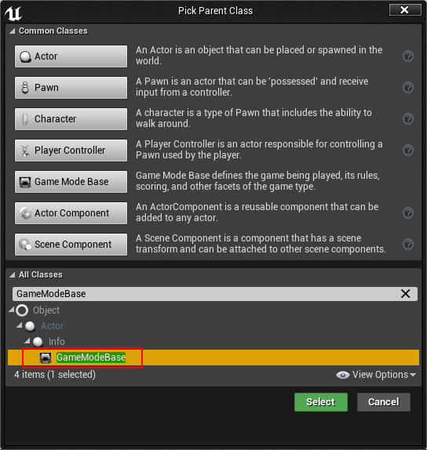

# Overview
**UnLua** is a **feature-rich**, **easy-learning** and **highly optimized** scripting solution for UE. UnLua follows the programming pattern of UE. UE programmers can use it at zero learning cost.

# Main features
* Access all **UCLASS**, **UPROPERTY**, **UFUNCTION**, **USTRUCT**, **UENUM** without glue codes.
* Override **'BlueprintEvent'** (UFUNCTIONs tagged with **'BlueprintImplementableEvent'** or **'BlueprintNativeEvent'**, **All** Events/Functions defined in Blueprints) without helper codes.
* Override **Replication Notify** without helper codes.
* Override **Animation Notify** without helper codes.
* Override **Input Event** without helper codes.
* Simple solution to export classes, member variables, member functions, global functions and enums outside the reflection system statically.
* Highly optimized **UFUNCTION** invoking (including persistent parameters buffer, optimized local function invoking, optimized parameters passing, optimized output values handling).
* Optimized containers (**TArray**, **TSet**, **TMap**) accessing. There is no conversion between Lua table and containers.
* Optimized structure accessing.

# More features
* Support default parameters of **UFUNCTION** (tagged with **'BlueprintCallable'** or **'Exec'**) parameters.
* Support **customized collision enums**.
* Support **server/clients** simulation in editor.
* Support exporting Lua template file for blueprints.
* Support calling **Latent** functions in Lua coroutines.

# Modules
* **UnLua**. Main **'Runtime'** module.
* **UnLuaEditor**. **'Editor'** module includes editor extention (Lua template exporting) and a commandlet.
* **UnLuaDefaultParamCollector**. **'Program'** module to collect default parameters for UFUNCTION.
* **UnLuaIntelliSense**. **'Program'** module to generate **IntelliSense** (**symbols**) of all **UCLASS**, **UPROPERTY**, **UFUNCTION**, **USTRUCT**, **UENUM** for a **private** IDE (which will be **PUBLIC** soon). It's **disabled** by default.

# Supported engine versions
Unreal Engine 4.17.x - Unreal Engine 5.x

**NOTE**: build.cs files need tiny modifications under 4.17.x and 4.18.x.

# Quick start
* Create a new Blueprint.

* Implement **'UnLuaInterface'**.

* Return a Lua file path (**relative** to **'Content/Script'**) in **'GetModuleName'**.

* Create Lua template.

* Generated Lua template.

* Add Lua codes to Lua template.

# Documentation
* [Programming Guide](Docs/EN/UnLua_Programming_Guide.md)
* [How to Implement Overriding](Docs/EN/How_To_Implement_Overriding.md)

# License
* UnLua is distributed under the terms of [the MIT license](LICENSE.TXT)
